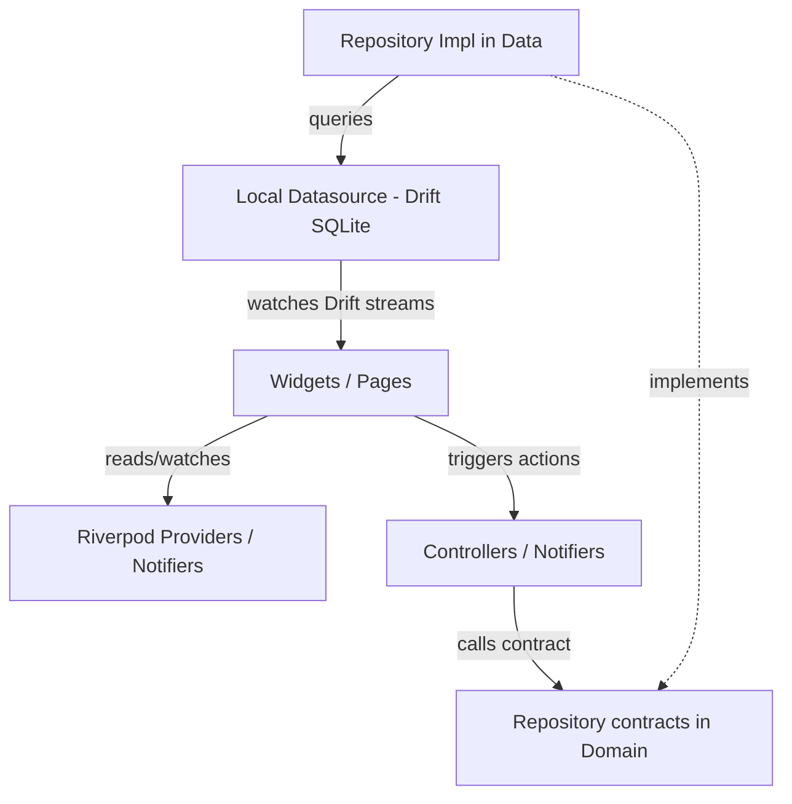

# System Map — Link Saver

## Project Overview

* **Project Name:** Link Saver (AI-Powered Bookmark & Knowledge Graph App)
* **Purpose:** Modern, visually immersive bookmark and knowledge management second-brain system. Save URLs, auto-extract metadata, organize into folders and tags, and view relationships on an interactive force-directed graph.
* **Platforms:** Flutter (Android, iOS, Web, Desktop)
* **Main Stack:**
  * **Framework:** Flutter (Dart)
  * **State Management:** Riverpod (`flutter_riverpod`, with code generation)
  * **Local Database:** Drift (SQLite with reactive streams and transaction safety)
  * **Routing:** GoRouter (`go_router`)
  * **Scraping:** Dio + HTML parser for metadata extraction
  * **Animations:** `flutter_animate`, spring curves

---

## Folder Structure

```plaintext
project/
 ├── .agents/                  # AI-Native Intelligence System
 │    ├── architecture/         # System architecture & maps
 │    ├── maps/                 # Detailed feature & dependency maps
 │    ├── agents/               # Persona guidelines for AI agents
 │    ├── skills/               # Reusable workflows
 │    ├── prompts/              # Context loading triggers
 │    ├── decisions/            # ADR documents
 │    └── sessions/             # History of development sessions
 ├── lib/                       # Flutter Source Code
 │    ├── core/                 # Shared database, routing, design system & providers
 │    │    ├── database/        # Drift database initialization & schema definition
 │    │    ├── providers/       # Global provider hooks (e.g. sharing intent listeners)
 │    │    ├── router/          # Centralized GoRouter routing configuration
 │    │    └── theme/           # Premium Light (Notion-style) & Dark (True OLED) theme tokens
 │    └── features/             # Feature-first modules
 │         ├── auth/            # Routing splash/onboarding check
 │         ├── bookmarks/       # Feed feed, cards, details, add sheet, CRUD repository
 │         ├── graph/           # Node and edge force-directed visualization
 │         ├── search/          # Real-time full-text indexing panel
 │         └── settings/        # CSV backup operations and settings toggles
```

---

## Architecture & Design Patterns

The application follows **Clean Architecture** combined with a **Feature-first** structure:
1. **Presentation Layer (`presentation/`)**:
   * UI components, page routes, and custom widgets.
   * State and logic separation via Riverpod Providers, Notifiers, and AsyncNotifiers.
2. **Domain Layer (`domain/`)**:
   * Business rules, entity schemas (plain Dart classes), and Repository contracts.
   * Free from UI framework and database dependencies.
3. **Data Layer (`data/`)**:
   * Concrete implementations of Repository contracts.
   * Data Sources (Drift SQLite local DB, network scrapers, CSV exporters).
   * DTO mappings.

---

## State Flow



1. **User Interaction**: Tapping a button triggers a method on a Riverpod controller/notifier.
2. **Business Execution**: The controller invokes the domain repository contract.
3. **Data Access**: The repository implementation accesses local Drift SQLite database tables or triggers network requests.
4. **Reactive Update**: Drift watches DB tables and triggers stream updates, which flow through Riverpod stream providers back to the UI, rebuilding widgets instantly.

---

## Native Android Layer

Flutter handles the main framework UI and database. Kotlin and native bridges are configured for:
* **Native Sharing Intent (`receive_sharing_intent`)**: Catches incoming shared URLs from third-party browsers/apps (Chrome, Twitter, YouTube). Fires a global listener in the Flutter background lifecycle and loads the `AddBookmarkSheet` on the home screen.
* **Storage Access (`path_provider`)**: Locates the SQL file container path (`getApplicationDocumentsDirectory()`) safely on Android's sandbox storage.

---

## Critical Services

### 1. `AppDatabase` (Drift SQLite)
Defined in [app_database.dart](file:///d:/projects/flutter%20projects/bookmark%20manager/link_saver/lib/core/database/app_database.dart). Houses the following schemas:
* `Bookmarks`: Core details, folderId mapping, category, and metadata.
* `Tags`: Multi-tag list matching labels to color hexes.
* `BookmarkTags`: Pivot table mapping bookmarks to tags (Many-to-Many).
* `Folders`: Parent-child folder nesting.

### 2. `BookmarkRepository`
Main CRUD controller mapping Drift data rows to Clean Domain entities. Handles transactions when deleting a bookmark to clear pivot relationships.

### 3. `MetadataService`
Scrapes shared URLs using HTTP clients to pull OpenGraph tags, HTML title elements, meta descriptions, site favicons, and hero image links.

---

## Navigation & App Flow

Managed via `GoRouter` in [app_router.dart](file:///d:/projects/flutter%20projects/bookmark%20manager/link_saver/lib/core/router/app_router.dart):
1. **SplashPage (`/`)**: Checks initial launch, runs database migrations, handles cold-start sharing intents, and redirects to Home.
2. **HomePage (`/home`)**:
   * Dashboard grid displaying saved bookmarks.
   * Pull-out folders drawer.
   * Bottom sheet trigger for quick adding.
3. **DetailPage (`/bookmark/:id`)**: Displays bookmark summary, notes, and detailed tags. Includes a link to open the saved URL in an in-app browser or native web engine.
4. **GraphPage (`/graph`)**: Renders Obsidian-style force-directed relational layout of folders, tags, and bookmarks.
5. **SearchPage (`/search`)**: Real-time full-text indexing panel.
6. **SettingsPage (`/settings`)**: Theme adjustments, duplicate bookmark finder, and manual imports.
