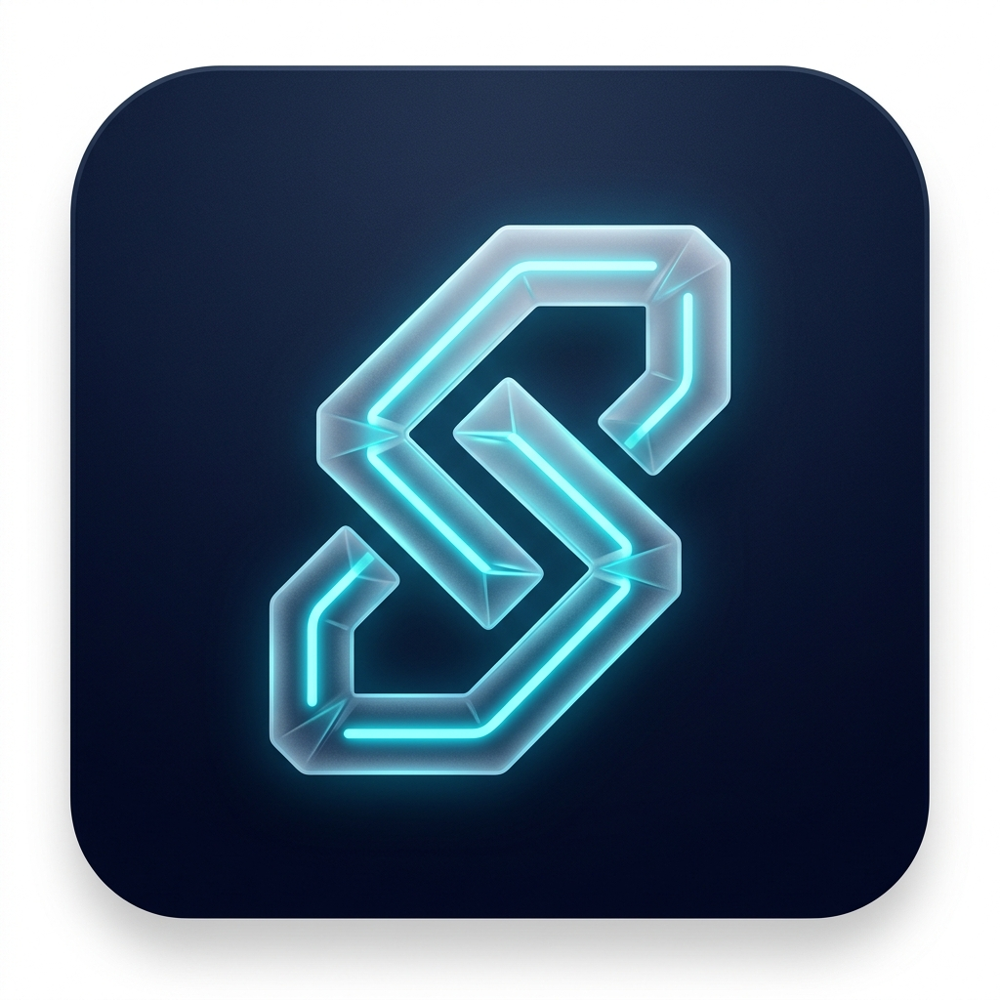
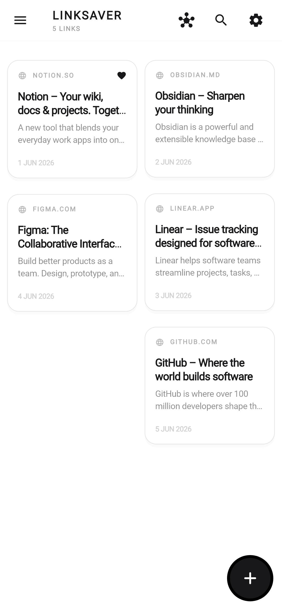
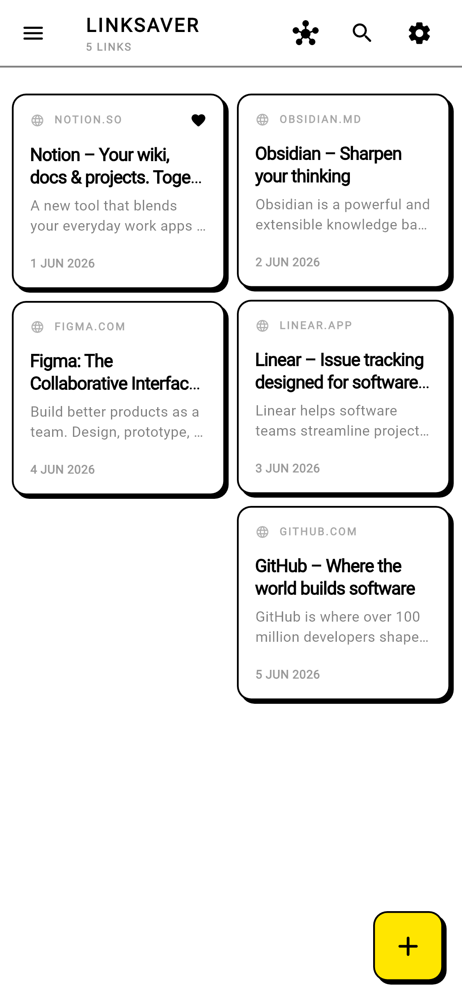
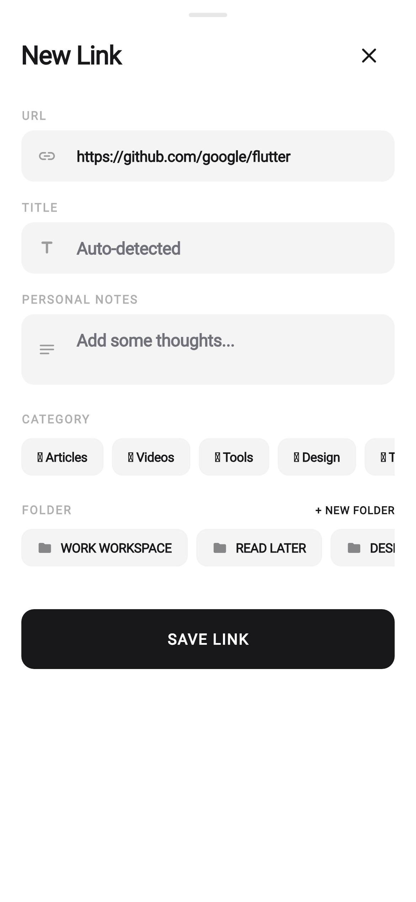
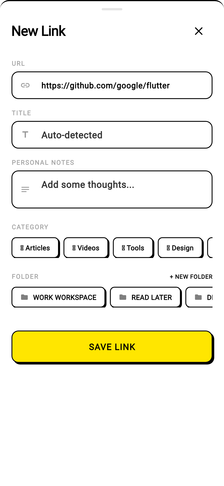
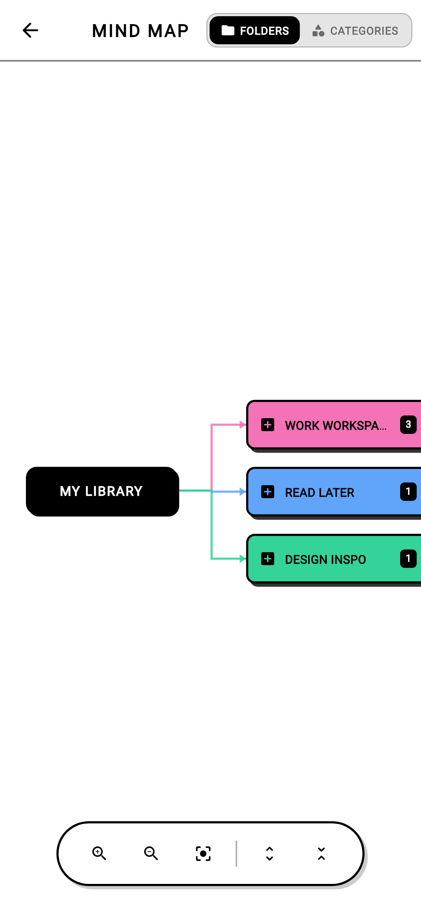
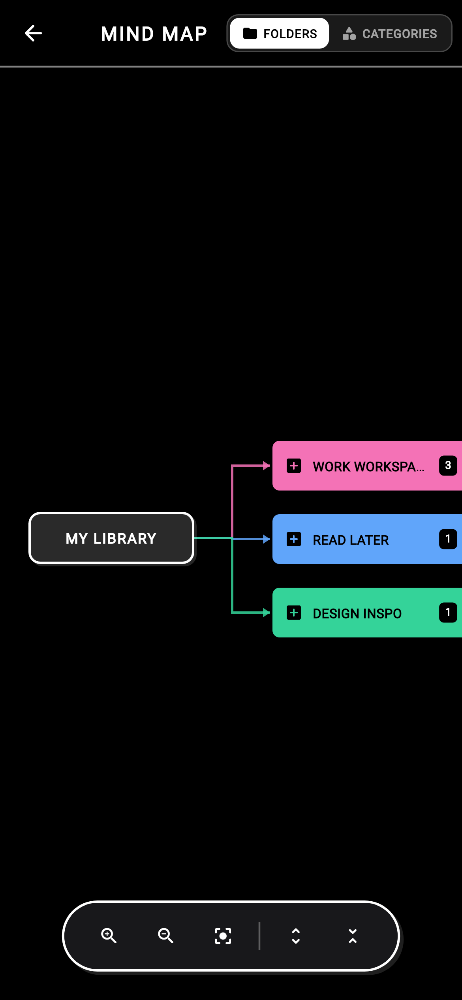
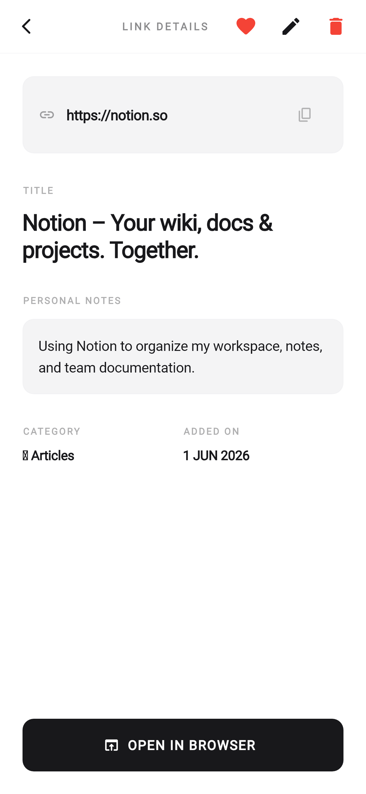
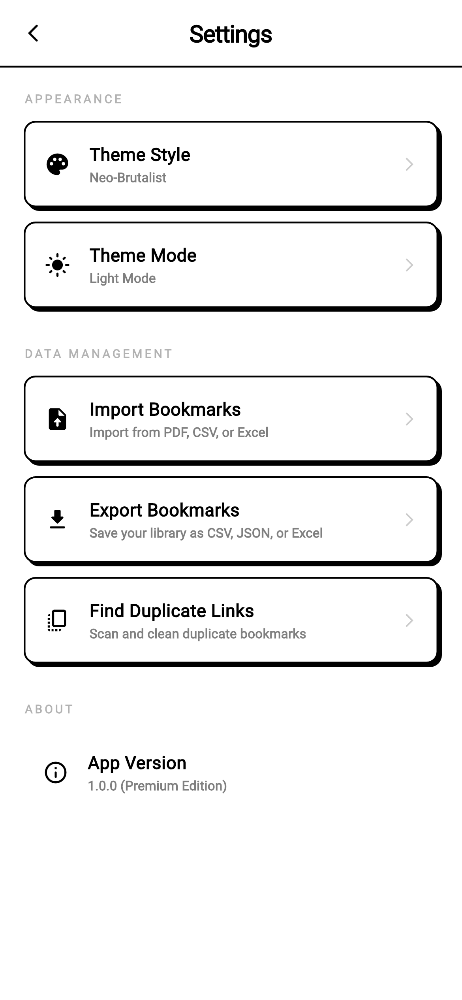

#  Social Media Link Saver

An offline-first visual bookmark manager and mind-map organizer built with Flutter. Save any link with offline database caching, custom tag relationships, and nested folder structures.

## Core Features
* **Obsidian-Style Mind Map**: Renders real-time node relationships, zoom, pan, and clustering using CustomPainters at 60 FPS.
* **Pinterest-Style Feed**: A responsive masonry layout utilizing lazy-loaded and cached preview images.
* **Automated URL Scraper**: Extracts page title descriptions and open-graph tags using background HTTP parsing.
* **Isar/Drift Database**: Schema-migration-safe offline storage.

## Golden Test Screenshots

| Home Page Classic (Light) | Home Page Neo (Light) | Add Bookmark Classic | Add Bookmark Neo |
|---|---|---|---|
|  |  |  |  |

| Mind Map (Neo Light) | Mind Map (Neo Dark) | Detail Page (Classic Light) | Settings (Neo Light) |
|---|---|---|---|
|  |  |  |  |
